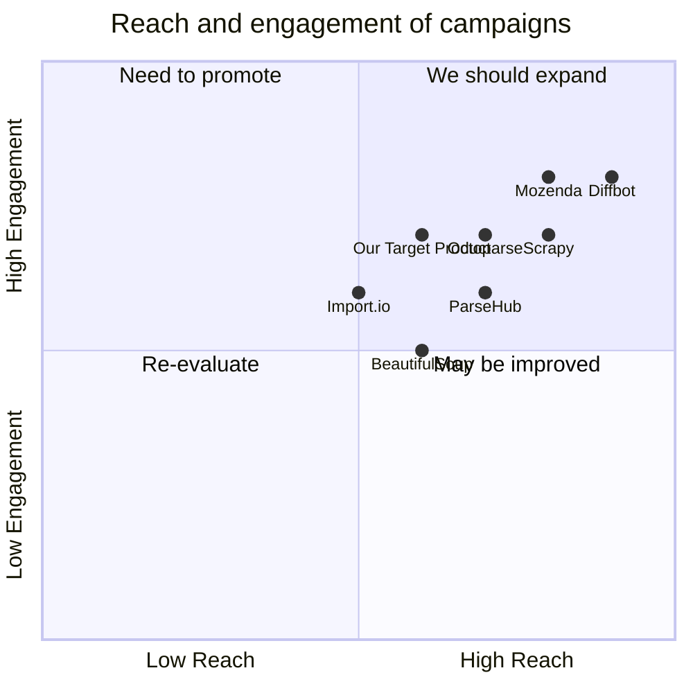

## Original Requirements
The boss wants to create a web crawler project that can visit insurance company websites and obtain detailed information about the company's products. This information includes product name, plan, coverage, benefits, and clauses. The information is not located on one page, so the crawler needs to be able to find and follow links to gather all the necessary data. The entry point for the crawler will be a URL provided by the boss.

## Product Goals
```python
[
    "Create a web crawler that can efficiently gather detailed product information from insurance company websites.",
    "Ensure the crawler can follow links to gather information not located on the entry page.",
    "Design the crawler to be easily adjustable to different insurance company websites."
]
```

## User Stories
```python
[
    "As a user, I want to input a URL and have the crawler gather all relevant product information.",
    "As a user, I want the crawler to follow links on the page to find additional information.",
    "As a user, I want to be able to easily adjust the crawler to different insurance company websites.",
    "As a user, I want the crawler to organize the gathered information in an easy-to-read format.",
    "As a user, I want the crawler to run efficiently and quickly."
]
```

## Competitive Analysis
```python
[
    "Scrapy: A powerful open-source web crawling framework, but may be too complex for this specific use case.",
    "BeautifulSoup: A Python library for pulling data out of HTML and XML files. It's easy to use but may lack the depth needed for this project.",
    "ParseHub: A visual data extraction tool that can handle websites with JavaScript, AJAX, cookies, sessions, and redirects. However, it's not as customizable as a self-built crawler.",
    "Octoparse: A robust web scraping tool that supports multiple data export methods. It's easy to use but may not offer the flexibility needed for this project.",
    "Import.io: A platform that allows users to convert a webpage into a table of data. It's user-friendly but may not be able to handle complex crawling tasks.",
    "Diffbot: Uses machine learning to automatically extract data, but may be overkill for this project and more expensive.",
    "Mozenda: A cloud-based web scraping platform that provides both the hardware and software for web data extraction. It's powerful but may not be necessary for this project."
]
```

## Competitive Quadrant Chart


## Requirement Analysis
The product should be a web crawler specifically designed to gather product information from insurance company websites. It should be able to follow links to gather information not located on the entry page. The crawler should be easily adjustable to different insurance company websites and should organize the gathered information in an easy-to-read format. It should also run efficiently and quickly.

## Requirement Pool
```python
[
    ("The crawler must be able to gather product name, plan, coverage, benefits, and clauses from a given URL.", "P0"),
    ("The crawler must be able to follow links on the page to find additional information.", "P0"),
    ("The crawler should be easily adjustable to different insurance company websites.", "P1"),
    ("The crawler should organize the gathered information in an easy-to-read format.", "P1"),
    ("The crawler should run efficiently and quickly.", "P2")
]
```

## UI Design draft
The user interface should be simple and intuitive. It should have a single input field for the user to enter the URL. Once the URL is entered, the user can press a 'Start Crawling' button to initiate the process. The gathered information should be displayed in a table format with columns for product name, plan, coverage, benefits, and clauses. The table should be sortable and searchable for easy navigation.

## Anything UNCLEAR
There are no unclear points.