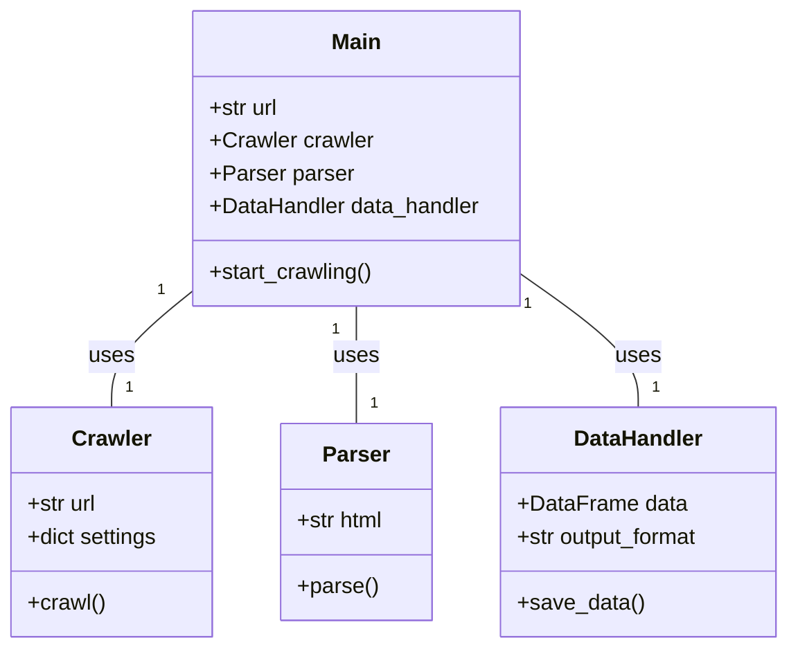
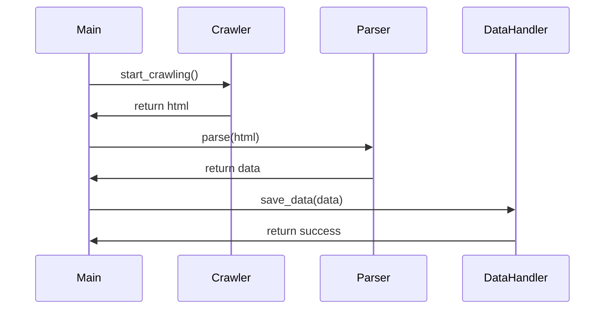

## Implementation approach
We will use Scrapy, an open-source Python framework, to build our web crawler. Scrapy is a powerful and flexible framework that can handle complex crawling tasks. It also provides built-in functionality for following links and extracting data from websites. We will also use BeautifulSoup, another open-source Python library, to parse the HTML and XML files. BeautifulSoup is easy to use and can handle different website structures, making our crawler more adjustable. Finally, we will use Pandas, a Python data analysis library, to organize the gathered data into a DataFrame, which can be easily converted into an easy-to-read format.

## Python package name
```python
"insurance_crawler"
```

## File list
```python
[
    "main.py",
    "crawler.py",
    "parser.py",
    "data_handler.py",
    "settings.py"
]
```

## Data structures and interface definitions


## Program call flow


## Anything UNCLEAR
The requirement is clear to me. However, the complexity of the project may vary depending on the structure of the insurance company websites. Some websites may require more complex crawling and parsing strategies. Therefore, the design and implementation of the crawler, parser, and data handler may need to be adjusted accordingly.